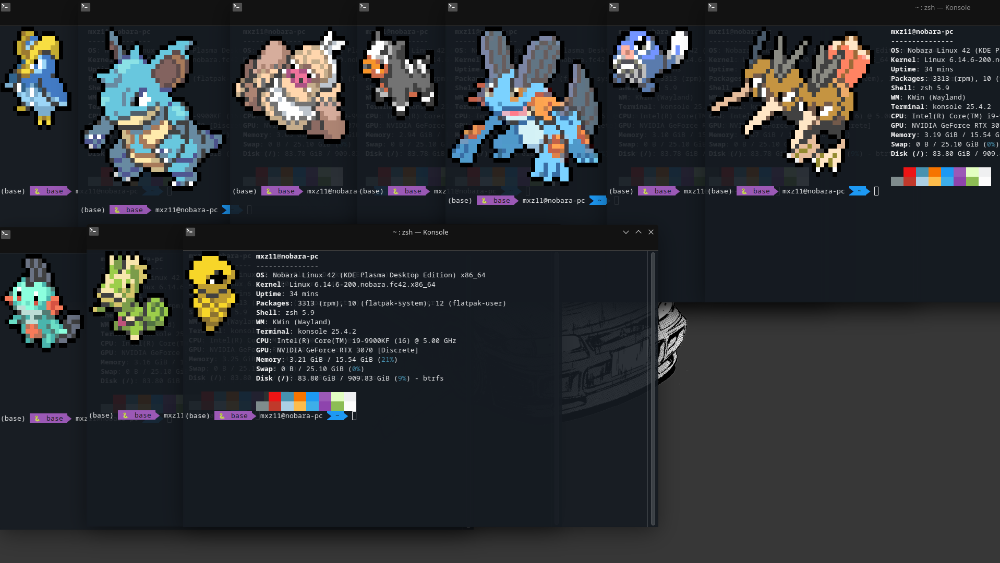

# README — Fastfetch + Pokeget with a Random Pokémon Logo



> **Goal:** show a **different Pokémon (ID 1‑493)** every time you start a new shell session.
> We combine **Pokeget** (sprite generator) with **Fastfetch** (system‑info fetch).
> This guide walks you through installation, configuration, automation, and troubleshooting.

---

## Table of Contents

* [1  Overview](#1--overview)
* [2  Prerequisites](#2--prerequisites)
* [3  Install Pokeget](#3--install-pokeget)

  * [3.1  Via Cargo](#31--via-cargo-works-on-any-platform)
  * [3.2  Distribution packages (Linux)](#32--distribution-packages-linux)
  * [3.3  macOS (Homebrew)](#33--macos-homebrew)
* [4  Install Fastfetch](#4--install-fastfetch)

  * [4.1  Package manager](#41--package-manager)
  * [4.2  Build from source](#42--build-from-source)
* [5  Configure Fastfetch](#5--configure-fastfetch)

  * [5.1  Locate or create the config file](#51--locate-or-create-the-config-file)
  * [5.2  Set the logo block](#52--set-the-logo-block)
* [6  Automation Script (`pokeget-random-logo`)](#6--automation-script-pokeget-random-logo)
* [7  Integrate with your shell](#7--integrate-with-your-shell-bash-or-zsh)
* [8  Using Neofetch instead (optional)](#8--using-neofetch-instead-optional)
* [9  Quick verification checklist](#9--quick-verification-checklist)
* [10  Credits](#10--credits)

---

## 1  Overview

* **Fastfetch** prints system information in the terminal (like Neofetch, but faster & JSONC‑configurable).
* **Pokeget** outputs colourful ANSI sprites of any Pokémon.
* A tiny **Bash script** runs Pokeget, saves its output to a text file, and Fastfetch reads that file as its logo.

---

## 2  Prerequisites

| Program                   | Purpose                                                |
| ------------------------- | ------------------------------------------------------ |
| Bash / Zsh                | Runs the helper script.                                |
| `rustup` + Cargo          | Builds Pokeget (and optionally Fastfetch) from source. |
| Fastfetch                 | Displays system info with a custom ASCII/ANSI logo.    |
| Pokeget                   | Generates Pokémon sprites.                             |
| (optional) `git`, `cmake` | Needed only for building Fastfetch from source.        |

> **True‑color required** – your terminal must support 24‑bit colour to see the sprites properly.

---

## 3  Install Pokeget

### 3.1  Via Cargo (works on any platform)

```bash
# 1  Install Rust + Cargo if missing
curl --proto '=https' --tlsv1.2 -sSf https://sh.rustup.rs | sh
source "$HOME/.cargo/env"   # activate Cargo in the current shell

# 2  Install Pokeget
cargo install pokeget
```

The binary lands in `~/.cargo/bin/pokeget`.

### 3.2  Distribution packages (Linux)

| Distro          | Command                                                 |
| --------------- | ------------------------------------------------------- |
| Arch / Manjaro  | `sudo pacman -S pokeget` (or `yay -S pokeget` from AUR) |
| Debian / Ubuntu | compile with Cargo (no official .deb yet)               |

### 3.3  macOS (Homebrew)

```bash
brew install pokeget          # if a formula exists
# or
cargo install pokeget         # universal fallback
```

---

## 4  Install Fastfetch

### 4.1  Package manager

| Distro           | Command                                             |
| ---------------- | --------------------------------------------------- |
| Arch / Manjaro   | `sudo pacman -S fastfetch`                          |
| Debian / Ubuntu  | `sudo apt install fastfetch` (via backports or PPA) |
| Fedora           | `sudo dnf install fastfetch`                        |
| macOS (Homebrew) | `brew install fastfetch`                            |

### 4.2  Build from source

```bash
git clone --depth=1 https://github.com/fastfetch-cli/fastfetch.git
cd fastfetch
cmake -B build -DCMAKE_BUILD_TYPE=Release
cmake --build build -j$(nproc)
sudo cmake --install build
```

---

## 5  Configure Fastfetch

### 5.1  Locate or create the config file

| OS            | Default path                                   |
| ------------- | ---------------------------------------------- |
| Linux / \*BSD | `~/.config/fastfetch/config.jsonc`             |
| macOS         | `~/Library/Preferences/fastfetch/config.jsonc` |
| Windows       | `%APPDATA%\fastfetch\config.jsonc`             |

Create the directory and a starter config:

```bash
mkdir -p ~/.config/fastfetch
fastfetch --gen-config       # creates config.jsonc
```

### 5.2  Set the logo block

Add/replace in `config.jsonc`:

```jsonc
"logo": {
  "type": "file",
  "path": "/home/<USER>/.config/fastfetch/ty.txt",  // adjust USER
  "padding": { "right": 2 }
},
```

*Newer builds prefer **path**; older accept **source**.*

---

## 6  Automation Script (`pokeget-random-logo`)

Create `~/.local/bin/pokeget-random-logo`:

```bash
#!/usr/bin/env bash
# Generates a random Pokémon (1‑493) and overwrites ty.txt
set -euo pipefail
OUT_FILE="$HOME/.config/fastfetch/ty.txt"
mkdir -p "$(dirname "$OUT_FILE")"

# Resolve pokeget
POKEGET_BIN=$(command -v pokeget || true)
[[ -z "$POKEGET_BIN" ]] && POKEGET_BIN="$HOME/.cargo/bin/pokeget"
[[ -x "$POKEGET_BIN" ]] || { echo "❌  pokeget not found" >&2; exit 1; }

# Random number 1‑493
if command -v shuf >/dev/null; then
  NUM=$(shuf -i 1-493 -n 1)
else
  NUM=$(( (RANDOM % 493) + 1 ))
fi

# Generate sprite without name and overwrite
"$POKEGET_BIN" "$NUM" --hide-name > "$OUT_FILE"
```

Make it executable and ensure `~/.local/bin` is in your `$PATH`:

```bash
chmod +x ~/.local/bin/pokeget-random-logo
export PATH="$HOME/.local/bin:$PATH"
```

---

## 7  Integrate with your shell (Bash or Zsh)

Append to `~/.bashrc` **or** `~/.zshrc`:

```bash
# 1  ensure Cargo bin dir is in PATH
export PATH="$HOME/.cargo/bin:$PATH"

# 2  generate fresh Pokémon logo
~/.local/bin/pokeget-random-logo

# 3  show Fastfetch
fastfetch
```

Reload:

```bash
source ~/.bashrc   # or source ~/.zshrc
```

Open a new terminal — a new Pokémon will greet you.

---

## 8  Using Neofetch instead (optional)

```bash
~/.local/bin/pokeget-random-logo
neofetch --ascii ~/.config/fastfetch/ty.txt
```

Add both lines to your shell‑rc.

---

## 9  Quick verification checklist

```bash
which pokeget
which fastfetch
cat ~/.config/fastfetch/ty.txt | head -n 5
fastfetch --log-level info | grep Logo
```

---

## 10  Credits

* **talwat/pokeget** — Pokémon sprites in ANSI.
* **fastfetch-cli/fastfetch** — blazing‑fast system fetch.

Enjoy your console with a new Pokémon buddy each session! 🎮✨
